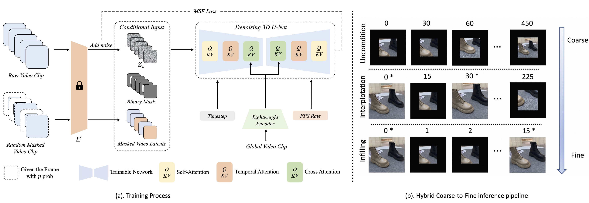

# M3DDM-Video-Outpainting

Official code for the paper:

> **Hierarchical Masked 3D Diffusion Model for Video Outpainting**, ***ACM MM 23***.
>
> Fanda Fan, Chaoxu Guo, Litong Gong, Biao Wang, Tiezheng Ge, Yuning Jiang, Chunjie Luo, Jianfeng Zhan
>
> <a href='https://arxiv.org/abs/2309.02119'></a> <a href='https://fanfanda.github.io/M3DDM/'></a> <a href='https://github.com/alimama-creative/M3DDM-Video-Outpainting'></a>


<p align="center">
  
</p>

<em>We propose a Masked 3D Diffusion Model (M3DDM) and a hybrid coarse-to-fine inference pipeline for video outpainting. Our method can not only generate high temporal consistency and reasonable outpainting results but also alleviate the problem of artifact accumulation in long video outpainting.</em>


## :fire:News
- [01/24/2024] Technical post released! (Chinese version: [视频尺寸魔方：分层遮掩3D扩散模型在视频尺寸延展的应用](https://mp.weixin.qq.com/s/vCL26VrROLNFJNiVsqrQaw))
- [01/12/2024] Inference code and model weights released!


## Environment Setup


1. Install PyTorch 2.0.1 with CUDA support via conda:

```sh
conda install pytorch==2.0.1 torchvision==0.15.2 torchaudio==2.0.2 pytorch-cuda=11.7 -c pytorch -c nvidia
```

Make sure you have Anaconda or Miniconda installed before running this command. This is our testing environment, but it can also run on versions of PyTorch greater than 1.10.0.

2. Install the required dependencies from the `requirements.txt` file in this repository:
```bash
pip install -r requirements.txt
```

## Downloads

Before you can run the project, you need to download the following:

1. **Pre-trained Stable Diffusion Model Weights**:
   
   We used the VAE encoder and decoder inside Stable Diffusion Model. To get the pre-trained stable diffusion v1.5 weights, download them from the following link:
   
   [https://huggingface.co/runwayml/stable-diffusion-v1-5](https://huggingface.co/runwayml/stable-diffusion-v1-5)


2. **Our Video-Outpainting Model Checkpoints**:
   
   Our network architecture is based on modifications of the Stable Diffusion Model v1.5. To get the pre-trained model weights, download them from the following link:
   
   [https://huggingface.co/alimama-creative/M3DDM-Video-Outpainting](https://huggingface.co/alimama-creative/M3DDM-Video-Outpainting)
   
## Usage

You can run the inference code with the following command:
```bash
python src/inference.py --input_video_path "/path/to/your/input_video.mp4" \
        --pretrained_sd_dir "/path/to/your/stable_diffusion_weights" \
        --video_outpainting_model_dir "/path/to/your/video_outpainting_model" \
        --output_dir "/path/to/your/output_directory" \
        --target_ratio_list "9:16" \
        --copy_original
```

Parameters

`target_ratio_list`: This parameter specifies the aspect ratio for the output video. You can input a single value such as "1:1", "16:9", or "9:16", or you can input a list like "16:9,9:16". For better results, we recommend inputting a single value.

`copy_original`: This parameter specifies whether to replace the corresponding parts of the generated video with the original video. It is worth noting that the parts of the original video being replaced have already been resized to meet a resolution of 256.

<!-- ## Results

<table>
  <tr>
    <td></td>
    <td></td>
  </tr>
  <tr>
    <td></td>
    <td></td>
  </tr>
  <tr>
    <td></td>
    <td></td>
  </tr>
</table> -->


## Citation

If this repo is useful to you, please cite our paper.

```bibtex
@inproceedings{fan2023hierarchical,
  title={Hierarchical Masked 3D Diffusion Model for Video Outpainting},
  author={Fan, Fanda and Guo, Chaoxu and Gong, Litong and Wang, Biao and Ge, Tiezheng and Jiang, Yuning and Luo, Chunjie and Zhan, Jianfeng},
  booktitle={Proceedings of the 31st ACM International Conference on Multimedia},
  pages={7890--7900},
  year={2023}
}
```
## Contact Us

Please feel free to reach out to us:

- Email: [fanfanda@ict.ac.cn](mailto:fanfanda@ict.ac.cn) and [gonglitong.glt@taobao.com](mailto:gonglitong.glt@taobao.com)

## **Acknowledgement**
We heavily borrow the code from [diffusers](https://github.com/huggingface/diffusers). Thanks for open-sourcing! We also gratefully acknowledge the Stable Diffusion for providing the [SD1.5 Model Weights](https://huggingface.co/runwayml/stable-diffusion-v1-5). Any third-party packages are owned by their respective authors and must be used under their respective licenses.

